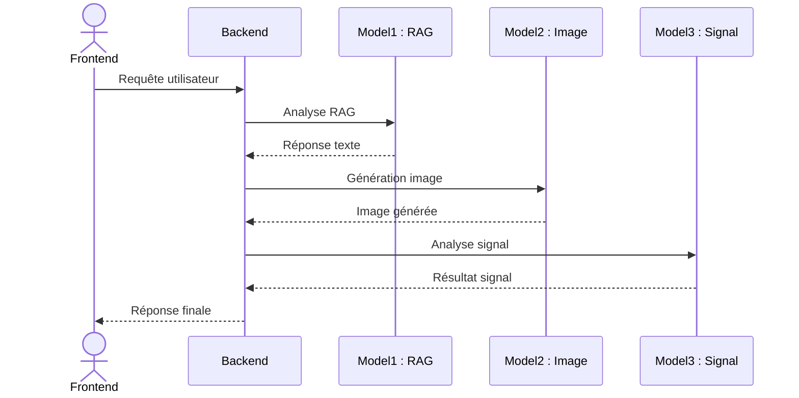

# SolarMind AI — Plateforme d'Intelligence Énergétique

**SolarMind AI** est une plateforme SaaS (Software as a Service) prête pour la production, conçue pour l'intelligence énergétique. Le système intègre de façon fluide un assistant conversationnel intelligent (RAG) spécialisé dans l'énergie solaire, un moteur de génération d'images pour les technologies vertes, et un module de prédiction IA pour analyser les signaux de production d'énergie solaire.

---

## 1. Architecture du Projet



---


L'architecture est basée sur un modèle client-serveur découplé, garantissant extensibilité, sécurité et performance :

### A. Le Frontend (Interface Utilisateur)
- **Technologies** : HTML5, CSS3, et Vanilla JavaScript pur, garantissant des temps de chargement ultra-rapides sans la surcharge de frameworks lourds.
- **Design** : Interface conversationnelle unifiée. L'utilisateur interagit avec tous les modules comme s'il s'agissait d'un chat (bulles de texte, de graphiques ou d'images).
- **Visualisation** : Les prédictions d'énergie générées par l'IA sont affichées de manière asynchrone via la bibliothèque `Chart.js` sans rechargement de la page.

### B. Le Backend (Cœur Applicatif et Proxy)
- **Technologies** : Python 3.10+, Framework FastAPI, Serveur Uvicorn.
- **Rôle de Proxy Sécurisé** : Le backend reçoit les requêtes du frontend et les relaie vers les API distantes (Hébergées sur Hugging Face Spaces). Cela permet de protéger les clés API, de contourner les restrictions CORS des navigateurs, et de traiter les opérations de longue durée (`Long-Running Processes`) sans bloquer le client.
- **Tolérance aux Pannes** : Les requêtes asynchrones gèrent les longs temps de calcul inhérents à l'intelligence artificielle sans limite stricte de temps de réponse (`timeout: None`).

### C. L'Intelligence de Routage (Smart Router)
- Le point d'entrée principal (`/api/assistant`) analyse chaque requête de l'utilisateur par traitement de mots-clés sémantiques.
- Si le terme suggère une image (ex: *dessine*, *génère*, *schéma*), la requête est dirigée vers le modèle de diffusion d'images.
- S'il s'agit d'une évaluation de performance (ex: *prédiction*, *signal*, *production*), elle invoque le modèle prédictif temporel.
- Sinon, la requête est envoyée au module RAG (Retrieval-Augmented Generation) pour une interrogation de la base de données de connaissances techniques documentées.

---

## 2. Déploiement et Opérations Cloud

Ce projet est configuré pour des pipelines de déploiement continu professionnels. 

### A. Déploiement via Infrastructure as Code (Render)
Un fichier de configuration `render.yaml` est inclus à la racine du projet pour faciliter un déploiement "Blueprint".
1. **Dépôt Git** : Le code complet de la branche principale est propulsé sur un dépôt GitHub.
2. **Synchronisation** : Le fournisseur cloud (Render, Railway, etc.) détecte tout changement, tire le code, installe les dépendances listées dans `requirements.txt` via `pip`.
3. **Exécution du Serveur** : Render compile l'environnement et lâche la commande de déploiement `uvicorn main:app --host 0.0.0.0 --port $PORT`. Contrairement aux solutions Serverless (comme AWS Lambda ou Vercel), les "Web Services" chez Render ne tuent pas les requêtes après 10 secondes, permettant au backend Python d'attendre la complétion des lourds calculs d'IA asynchrones d'Hugging Face.

### B. Exécution en Environnement Local (Développement)

**Prérequis :**
- Python 3.8 minimum
- pip (Gestionnaire de paquets Python)

**Instructions de lancement :**
```bash
# 1. Installation des dépendances strictes à l'environnement
pip install -r requirements.txt

# 2. Démarrage du serveur FastAPI local
uvicorn main:app --reload --host 0.0.0.0 --port 8000
```
*(Optionnel) Le frontal est accessible localement en ouvrant le fichier `frontend.html` par un navigateur moderne.*

---

## 3. Documentation de l'API REST (Endpoints)

L'API d'intégration documente ces routes principales. L'interface Swagger auto-générée est disponible en phase de développement via `http://localhost:8000/docs`.

### Dialogue Intellectif RAG (`POST /api/chat`)
- **Action** : Traite les réponses intelligentes depuis la base de connaissances solaire.
- **Entrée** : `{"message": "Comment fonctionne un panneau photovoltaïque ?"}`

### Génération Visuelle (`POST /api/image`)
- **Action** : Traite la génération visuelle par diffusion stable avec des directives strictes en steps et guidance.
- **Entrée** : `{"prompt": "champ de panneaux solaires", "guidance_scale": 8.5}`

### Modélisation Temporelle (`POST /api/signal/predict`)
- **Action** : Réceptionne 24 points d'historique (T2M et surface solaires irridiées) pour générer des prévisions numériques.
- **Format Requis** : Un Array explicite de 24 objets horodatés à la syntaxe exacte.

### Le Multi-Routeur Décisionnel (`POST /api/assistant`)
- **Action** : Cerveau logiciel agissant comme Dispatcher principal unifiant toute la logique Front-End dans un terminal commun.

---

## 4. Équipe de Recherche et Développement

Ce projet collaboratif a été conceptualisé, développé, et testé par l'équipe suivante :

- **Freddy OUEDRAOGO**
- **Soraya PITOIPA**
- **Jean De Dieu Eben-Ezer BAKOUAN**

---
*SolarMind AI — Propulser la transition énergétique mondiale grâce à une ingénierie logicielle robuste et une intelligence artificielle de pointe.*
